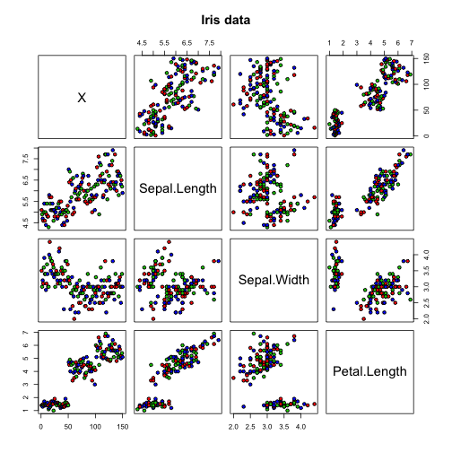
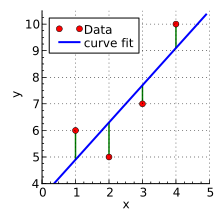
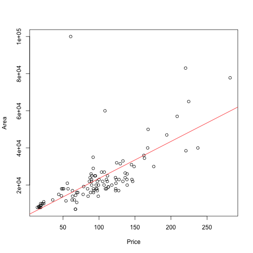
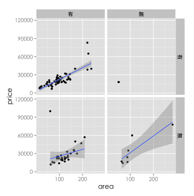

## Useful link

- Today's slide http://crystaltu.github.io/Ranalysis/index.html
- Morzilla Firefox https://mozilla.com.tw/
- DSP data center http://ckan.nispc.tw/organization/dsp-data-camp-at-nccu
- LibreOffice https://zh-tw.libreoffice.org/

---
## R basic Review 

- Basic command

```r
getwd() # where we are now
```

```r
setwd("path") # set working directory
```

```r
help() # get help
example() # get example
```

---
## Data

<left></left>

- Anderson's Iris data
- http://vincentarelbundock.github.io/Rdatasets/csv/datasets/iris.csv
- 臺北市實價登錄租賃資料 & YouBike 微笑單車 & YouBike X Weather Data
- http://ckan.nispc.tw/organization/dsp-data-camp-at-nccu

---
## Read data

```r
iris <- read.csv('iris.csv') # read iris data
str(iris)
```

```
## 'data.frame':	150 obs. of  6 variables:
##  $ X           : int  1 2 3 4 5 6 7 8 9 10 ...
##  $ Sepal.Length: num  5.1 4.9 4.7 4.6 5 5.4 4.6 5 4.4 4.9 ...
##  $ Sepal.Width : num  3.5 3 3.2 3.1 3.6 3.9 3.4 3.4 2.9 3.1 ...
##  $ Petal.Length: num  1.4 1.4 1.3 1.5 1.4 1.7 1.4 1.5 1.4 1.5 ...
##  $ Petal.Width : num  0.2 0.2 0.2 0.2 0.2 0.4 0.3 0.2 0.2 0.1 ...
##  $ Species     : Factor w/ 3 levels "setosa","versicolor",..: 1 1 1 1 1 1 1 1 1 1 ...
```

---
## Computation

- +, -, *, /
- 基本邏輯運算符號 (>, >=, <, <=, ==, not !=, and &, or |)

---

## Labeling categorical variables


```r
?factor
species <- factor(iris$Species, levels = c("setosa","versicolor","virginica"), 
                  labels = c("set","ver","vir"))
sample(species, size=10)
```

```
##  [1] set set ver vir ver vir set ver ver vir
## Levels: set ver vir
```

---

## Subseting


```r
library(dplyr)
virginica <- filter(iris, Species == "virginica")  #只選 I. virginica
```

```r
head(virginica)
```

```
##     X Sepal.Length Sepal.Width Petal.Length Petal.Width   Species
## 1 101          6.3         3.3          6.0         2.5 virginica
## 2 102          5.8         2.7          5.1         1.9 virginica
## 3 103          7.1         3.0          5.9         2.1 virginica
## 4 104          6.3         2.9          5.6         1.8 virginica
## 5 105          6.5         3.0          5.8         2.2 virginica
## 6 106          7.6         3.0          6.6         2.1 virginica
```

---

## Pivot table with `dplyr`

```r
summarise(group_by(iris,Species), mean(Sepal.Length), mean(Sepal.Width), 
          mean(Petal.Length), mean(Petal.Width))
```

```
## Source: local data frame [3 x 5]
## 
##      Species mean(Sepal.Length) mean(Sepal.Width) mean(Petal.Length)
## 1     setosa              5.006             3.428              1.462
## 2 versicolor              5.936             2.770              4.260
## 3  virginica              6.588             2.974              5.552
## Variables not shown: mean(Petal.Width) (dbl)
```

---

## Descriptive statistics


```r
summary(iris)
```

```
##        X           Sepal.Length    Sepal.Width     Petal.Length  
##  Min.   :  1.00   Min.   :4.300   Min.   :2.000   Min.   :1.000  
##  1st Qu.: 38.25   1st Qu.:5.100   1st Qu.:2.800   1st Qu.:1.600  
##  Median : 75.50   Median :5.800   Median :3.000   Median :4.350  
##  Mean   : 75.50   Mean   :5.843   Mean   :3.057   Mean   :3.758  
##  3rd Qu.:112.75   3rd Qu.:6.400   3rd Qu.:3.300   3rd Qu.:5.100  
##  Max.   :150.00   Max.   :7.900   Max.   :4.400   Max.   :6.900  
##   Petal.Width          Species  
##  Min.   :0.100   setosa    :50  
##  1st Qu.:0.300   versicolor:50  
##  Median :1.300   virginica :50  
##  Mean   :1.199                  
##  3rd Qu.:1.800                  
##  Max.   :2.500
```

--- &twocol
## Visualization

*** =left

```r
pairs(iris[1:4], main = "Iris Data", 
      pch = 21, bg = c("red","green3","blue"))
```

*** =right
 

---

## Save file for further use


```r
write.csv(x)
```

--- .segue .dark

## Scenario

---


---

## Questions

- 租金和坪數間，有什麼關係？（每坪租金大概多少錢？）
- 如果有關，這個關係有多強？
- 房屋類型（公寓、華廈）、屋齡、隔間數量或主要用途（住家、住商用）有沒有影響？
- 要如何估計每一個因素的影響程度？
- 如何利用已知關係，找出適合自己的選擇？

--- .segue .dark

## Model conception and definition

--- .largecontent

## I. Simple regression model

- $$Y=\beta_0 +\beta_1 X +\epsilon$$
- X: predictor
- Y: response


```r
lm(formula)
```

--- .largecontent

## Parameter estimation
- Least square method

<center></center>

--- .largecontent

## Goodness-of-fit

- R-square

$$R^2 = 1 - \frac{SS_{residual}}{SS_{total}} $$

---

## Example


```r
#taipei_rent <- read.table('TaipeiRealPriceRent_big5.csv',header=TRUE,sep=",") # for Windows
taipei_rent <- read.table('TaipeiRealPriceRent_utf8.csv',header=TRUE,sep=",")
oldtype <- unique(taipei_rent$建物型態)
type <- factor(taipei_rent$建物型態, levels=oldtype, labels=c("住宅","商辦","華廈","公寓","店面","套房","廠辦","其他","透天厝","倉庫","工廠"))
taipei_rent$建物型態 <- type

library(dplyr)
wenshan <- filter(taipei_rent, 鄉鎮市區 == "文山區",主要用途 == "住家用"); #選文山區建物資料
tab1 <- select(wenshan,建物移轉總面積.平方公尺.,總價.元.)
tab2 <- select(wenshan,交易標的,建物型態,建物移轉總面積.平方公尺.,總價.元.,有無附傢俱,有無管理組織,contains("建物現況格局"));
names(tab1) <- c("area","price")
names(tab2) <- c("target","type","area","price","furniture","management","room","hall","toilet","seperation")
```


--- &vcenter
## Simple linear regresion

```r
# simple linear regression with price~area
model1 <- lm(price~area,data=tab1)
plot(tab1$price~tab1$area,xlab="Area",ylab="Price");abline(model1, col="red")
```

 

---


```r
summary(model1) # R-square=0.4686 summary of model result
```

```
## 
## Call:
## lm(formula = price ~ area, data = tab1)
## 
## Residuals:
##    Min     1Q Median     3Q    Max 
## -12027  -5382  -1481   2338  84258 
## 
## Coefficients:
##             Estimate Std. Error t value Pr(>|t|)    
## (Intercept)  3625.79    2326.18   1.559    0.122    
## area          199.45      20.83   9.577 5.94e-16 ***
## ---
## Signif. codes:  0 '***' 0.001 '**' 0.01 '*' 0.05 '.' 0.1 ' ' 1
## 
## Residual standard error: 11330 on 104 degrees of freedom
## Multiple R-squared:  0.4686,	Adjusted R-squared:  0.4635 
## F-statistic: 91.71 on 1 and 104 DF,  p-value: 5.942e-16
```

---
## Prediction


```r
#make a new data set and predict the outcome
new <- data.frame(area=seq(50,100,10))
predict.lm(model1,newdata=new)
```

```
##        1        2        3        4        5        6 
## 13598.10 15592.56 17587.02 19581.48 21575.94 23570.40
```

---

## II. Multi-linear regression


```r
lm(Y~X1+X2+..+Xn)
```

- What is the relationship between Y and Xs?
- How many X need?
- How to estimate the goodness-of-fit?
- How accurate can the model predict?

---
## Qualitative predictor (factor() with levels)


```r
library(ggplot2)
qplot(area,price,data=tab2) + facet_grid(furniture~seperation) + 
  geom_smooth(method="lm") + theme(text=element_text(family="STHeiti",size=14))
```
<center></center>

---
## Multiple regression with categorical variable

```r
model2 <- lm(price~area+type+furniture+seperation,data=tab2)
summary(model2) #R-square=0.5050
```

```
## 
## Call:
## lm(formula = price ~ area + type + furniture + seperation, data = tab2)
## 
## Residuals:
##    Min     1Q Median     3Q    Max 
## -14057  -5069  -1633   2627  83750 
## 
## Coefficients:
##              Estimate Std. Error t value Pr(>|t|)    
## (Intercept)   6190.23    4135.87   1.497   0.1377    
## area           184.52      25.71   7.178 1.37e-10 ***
## type華廈     -3622.58    3228.08  -1.122   0.2645    
## type公寓     -3341.76    3213.58  -1.040   0.3010    
## type套房       913.80    7271.94   0.126   0.9003    
## type透天厝   -5087.50    8439.57  -0.603   0.5480    
## furniture無   2192.20    2555.76   0.858   0.3931    
## seperation無  7699.02    4112.74   1.872   0.0642 .  
## ---
## Signif. codes:  0 '***' 0.001 '**' 0.01 '*' 0.05 '.' 0.1 ' ' 1
## 
## Residual standard error: 11260 on 98 degrees of freedom
## Multiple R-squared:  0.5051,	Adjusted R-squared:  0.4697 
## F-statistic: 14.29 on 7 and 98 DF,  p-value: 1.134e-12
```

---
## Predictions

```r
forecast <- data.frame(area=50,type="住宅",furniture="有",seperation="有")
predict(model2,forecast)
```

```
##        1 
## 15416.15
```

---
## Missing data 


```r
lm(formula,na.action=?)
```

---.segue .dark

## Remark

---
## Nonlinear relationship

<center></center>

---
## Interaction terms
[Simpson's paradox](http://vudlab.com/simpsons/)

---
## Correlation != Causation

<center></center>

[Source](http://www.businessweek.com/magazine/correlation-or-causation-12012011-gfx.html)

---
## Summary
- Linear model: lm(), abline()
- Model forecast: predict()

---

## Resource for further study
- Quick-R http://www.statmethods.net/
- R-blogger http://www.r-bloggers.com/
- stackoverflow https://stackoverflow.com/tags/R
- R-help mailing list https://stat.ethz.ch/mailman/listinfo/r-help

--- .segue .dark

## Q & A

--- .segue .dark

## IT'S YOUR TURN AGAIN

---
## Scenario

<center></center>

---
## YouBike x Weather 


```
##  [1] "日期"         "時間"         "場站代號"     "場站區域"    
##  [5] "場站名稱"     "經度"         "緯度"         "總停車格"    
##  [9] "平均車輛數"   "最大車輛數"   "最小車輛數"   "車輛數標準差"
## [13] "平均空位數"   "最大空位數"   "最小空位數"   "空位數標準差"
## [17] "氣溫"         "最高溫"       "最低溫"       "溼度"        
## [21] "氣壓"         "最大風速"     "降雨量"
```

---
## Question
- YouBike平均車輛數（或其他資料）會受天氣影響嗎？


