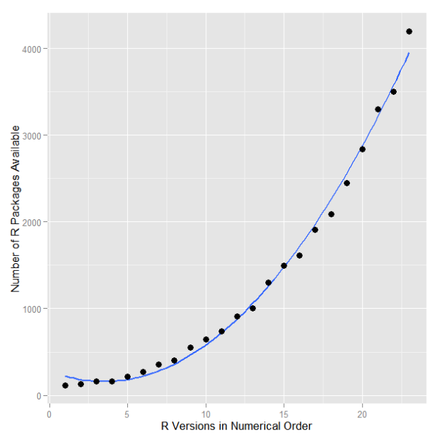

--- &twocol

## About Me

*** =left

- 臺灣大學海洋研究所博士班
- 專長：計量生態學
- 海洋所 `統計生態學與程式應用`
- 生命科學系 `生命科學數學`
- 新聞所 資料新聞學

*** =right


--- .segue .dark

## Scenario

---


---


--- &vcenter .largecontent

## Question

- 可以租出去的，大都是怎樣的`物件`？

---
## Data

- DSP資料中心：臺北市實價登錄租賃資料
- http://ckan.nispc.tw/organization/dsp-data-camp-at-nccu

<center></center>

---


```
##   年份 月份 交易類別   縣市 鄉鎮市區             交易標的
## 1  101    8     租賃 臺北市   內湖區 房地(土地+建物)+車位
## 2  101    8     租賃 臺北市   大安區      房地(土地+建物)
## 3  101    8     租賃 臺北市   大安區      房地(土地+建物)
## 4  101    8     租賃 臺北市   大安區      房地(土地+建物)
## 5  101    8     租賃 臺北市   大安區      房地(土地+建物)
## 6  101    8     租賃 臺北市   中山區      房地(土地+建物)
##             土地區段位置.建物區段門牌 土地移轉總面積.平方公尺.
## 1 臺北市內湖區內湖路二段253巷51~100號                  4065.00
## 2      臺北市大安區和平東路一段1~50號                    12.65
## 3      臺北市大安區安和路二段51~100號                     7.09
## 4    臺北市大安區和平東路三段51~100號                     4.43
## 5 臺北市大安區建國南路二段294巷1~50號                    23.27
## 6       臺北市中山區林森北路551~600號                     9.37
##   使用分區或編定 非都市土地使用分區 非都市土地使用地 交易年月
## 1             住               <NA>               NA    10108
## 2             商               <NA>               NA    10108
## 3             住               <NA>               NA    10108
## 4           其他               <NA>               NA    10108
## 5             住               <NA>               NA    10108
## 6             商               <NA>               NA    10108
##        交易筆棟數 移轉層次 總樓層數                   建物型態   主要用途
## 1 土地1建物1車位1     八層       11 住宅大樓(11層含以上有電梯)     住家用
## 2 土地1建物1車位0     六層       12               辦公商業大樓 見使用執照
## 3 土地1建物1車位0     三層       19 住宅大樓(11層含以上有電梯)     住家用
## 4 土地1建物1車位0     九層       12 住宅大樓(11層含以上有電梯)     住家用
## 5 土地1建物1車位0     二層        7     華廈(10層含以下有電梯)     住家用
## 6 土地1建物1車位0     十層       13 住宅大樓(11層含以上有電梯)     住家用
##           主要建材 建築完成年月 建物移轉總面積.平方公尺. 建物現況格局.房
## 1     鋼筋混凝土造       980923                    88.70               3
## 2     鋼筋混凝土造       780615                   143.62               0
## 3 鋼骨鋼筋混凝土造           NA                    73.19               2
## 4     鋼筋混凝土造       681020                    54.05               1
## 5     鋼筋混凝土造       721129                   117.02               3
## 6     鋼筋混凝土造      1000726                    90.51               2
##   建物現況格局.廳 建物現況格局.衛 建物現況格局.隔間 有無管理組織
## 1               2               2                有           有
## 2               2               2                有           無
## 3               1               1                有           有
## 4               1               1                有           有
## 5               2               2                有           無
## 6               1               1                有           有
##   有無附傢俱 總價.元. 單價.元.平方公尺. 車位類別 車位移轉總面積.平方公尺.
## 1         有    36000               406 坡道平面                        0
## 2         有    46000               320                                 0
## 3         有    37500               512                                 0
## 4         無    18000               333                                 0
## 5         有    30000               256                                 0
## 6         有    54000               597                                 0
##   車位總價.元. 交易標的橫坐標 交易標的縱坐標 Longitude Latitude
## 1            0         309340        2775245  121.5883 25.08422
## 2            0         302819        2768827  121.5234 25.02653
## 3            0         305701        2769278  121.5520 25.03049
## 4            0         305439        2768631  121.5493 25.02466
## 5            0         304201        2768594  121.5371 25.02437
## 6            0         303098        2773174  121.5263 25.06576
```

--- &twocol .segue .dark

### 為什麼大家都用R？

*** =right

Source: Nature

--- v&center

## R來自專業統計學家

- "The R Project for `Statistical Computing`"

<center></center>

圖片來源： <http://myfootpath.com/careers/engineering-careers/statistician-careers/>

--- v&center

## 驚人的彈性和發展性

<center></center>

取自 <http://r4stats.com/2013/03/19/r-2012-growth-exceeds-sas-all-time-total/>

---

## R 可以輸出高品質的視覺化作品


取自<http://www.r-bloggers.com/mapping-the-worlds-biggest-airlines/>

--- &vcenter

## R 很容易和其他工具整合

<center>
 
</center>

--- .largecontent

## Learning targets

- Setup R environment and familiarize with RStudio UI

- `Talks` in R

```r
# 1. Basic command  
# 2. Read & write data
# 3. Extract-Transform-Load
# 4. Exploratory data analysis 
# 5. Data visualization
```
- Challenges!

--- .segue .dark

## 工欲善其事，必先利其器

--- &vcenter .largecontent

## Install R and RStudio

### Live Demo!

--- &vcenter .largecontent

## RStudio Interface

- 程式碼編輯區
- 命令列區 (Console)
- 其他資訊區
- 檔案系統區

--- &vcenter .largecontent

## Familiarize with R and RStudio I

### 命令列區

- 最左下角的符號是`>`
- 輸入`"hello world"`後按下Enter，檢查螢幕輸出（記得加上引號）
- 輸入`1 + 1`後按下Enter，檢查螢幕輸出，注意有無引號
- 輸入`1 + `後按下Enter，檢查螢幕輸出，注意最左下角的開頭變成`+`
- 按下Ctrl + C或ESC，檢查哪一個按鈕會讓左下角回復成`>`開頭

--- &vcenter .largecontent

## Familiarize with R and RStudio II

### 命令列區

- 在新的一行命令列區輸入`he`之後按下Enter
- 在新的一行命令列區輸入`he`之後按下tab
- 最後輸入 Ctrl + L

--- &vcenter .largecontent

## Familiarize with R and RStudio III

### 程式碼編輯區

- 建立新的R Script檔案 (.r)
- 在第一行輸入`he`之後按下Ctrl + Enter後，觀察命令列區
- 利用滑鼠點選`he`後的位置，確認游標閃爍的位置在`he`之後，按下tab

--- &twocol

## 常用快捷鍵

*** =left
### 命令列區：
- Enter: 執行
- Tab: 提示
- Ctrl + C: 中斷程式
- Ctrl + L: 清空命令列

*** =right
### 程式碼編輯區：
- Ctrl + Enter (Command + Enter): 執行該行程式碼
(也可以用右上角的 `Run`)

--- .segue .dark

## R 的擴充功能 (View)

--- 

## [CRAN Task Views](http://cran.r-project.org/web/views/)


--- .largecontent

## Install package

### UI

- Tools -> Install packages... 

### Console


```r
install.views("topic-name")
install.packages("pkg-name", repos = "來源", type = "類別")
```

--- &vcenter .largecontent

## Challenge!

### Install package

- Install with UI- (package "dplyr")
- install.package

--- 
## Basic R command


```r
getwd() # where we are now
```

```r
setwd("path") # set working directory (keep your work together!)
```

--- .dark .segue

## Talk in R

--- &twocol .largecontent

## Expression

*** =left


```r
"1;2;3;"
```

```
## [1] "1;2;3;"
```

```r
1;2;3;
```

```
## [1] 1
```

```
## [1] 2
```

```
## [1] 3
```

```r
1;2;#3;
```

```
## [1] 1
```

```
## [1] 2
```

*** =right

- 以`;`或`空行`(輸入Enter) 結尾
- 單引號`'`或雙引號`"`所包覆的敘述表字串
- 不完整的敘述句，命令列的開頭會變成`+`
- 可以用`Ctrl + C`或`ESC` 中斷
- `#`表示註解，計算時會忽略

--- &twocol .largecontent

## Expression and arithematic

*** =left


```r
1 + 1
```

```
## [1] 2
```

```r
1 + 2 - 1
```

```
## [1] 2
```

```r
(1 + 1) * 2
```

```
## [1] 4
```

```r
2.5e3
```

```
## [1] 2500
```

*** =right

- 敘述句可以運算出一個R 物件 (object)
- 四則運算以括號內最優先，先乘除後加減
- 中間有`e`的數值，代表10的冪次方（科學記號）

--- &twocol .largecontent

## Assign value `<-` or `=`

*** =left


```r
One
```

```
## Error in eval(expr, envir, enclos): object 'One' not found
```

```r
One <- 1
One
```

```
## [1] 1
```

```r
Two = "2"
Two
```

```
## [1] "2"
```

*** =right

### Assign value

<center>

</center>

$$\Downarrow$$

<center>

</center>

--- &twocol .largecontent

## 向量 (vector)

*** =left


```r
c(1, 2, 3) + 1
```

```
## [1] 2 3 4
```

```r
1:3
```

```
## [1] 1 2 3
```

```r
1:3 * 2
```

```
## [1] 2 4 6
```

*** =right

- 利用`c`建立向量
- 利用`:`建立序列
- 運算是向量式的

<center></center>
$$\Downarrow$$
<center></center>

--- .segue .dark

## Data structure of R

--- &vcenter .largecontent

## Basic data type

- Numerical value (1, 0.35, 41.2)
- String ("大安區","A")
- Logic (TRUE,FALSE)
    - 基本邏輯運算符號 (>, >=, <, <=, ==, not !=, and &, or |)

---


```r
a <- 10; b <- "ten"; c <- "25"; d <- TRUE; e <- FALSE 
a > 1 # TRUE
```

```
## [1] TRUE
```

```r
a + b # error
```

```
## Error in a + b: non-numeric argument to binary operator
```

```r
a + c # error
```

```
## Error in a + c: non-numeric argument to binary operator
```

```r
d & e # FALSE
```

```
## [1] FALSE
```

--- &vcenter .largecontent

## Quantitative

- Price, height, weight, score, time...
- Numerical data in R
    - Integer `1L`
    - real`1.5`


```r
99L;99.5
```

```
## [1] 99
```

```
## [1] 99.5
```

--- &vcenter .largecontent

## Qualitative

- Area, class, usage...
- Categorical data in R
    - String
    - Factor


```r
c("011", "012");factor(c("三年甲班", "三年乙班", "三年甲班"))
```

```
## [1] "011" "012"
```

```
## [1] 三年甲班 三年乙班 三年甲班
## Levels: 三年乙班 三年甲班
```

--- &vcenter .largecontent

## 查詢變數的類別


```r
x <- 1:3
class(x);mode(x)
```

```
## [1] "integer"
```

```
## [1] "numeric"
```

```r
x <- c("1", "2", "3")
class(x);mode(x)
```

```
## [1] "character"
```

```
## [1] "character"
```

--- .segue .dark

## Read data

--- .largecontent

## read.table() with real data
- As a `data.frame`

```r
#taipei_rent <- read.table('TaipeiRealPriceRent_big5.csv',header=TRUE,sep=",") # for Windows
taipei_rent <- read.table('TaipeiRealPriceRent_utf8.csv', header = TRUE, sep = ",");
```

```r
names(taipei_rent)
```

```
##  [1] "年份"                      "月份"                     
##  [3] "交易類別"                  "縣市"                     
##  [5] "鄉鎮市區"                  "交易標的"                 
##  [7] "土地區段位置.建物區段門牌" "土地移轉總面積.平方公尺." 
##  [9] "使用分區或編定"            "非都市土地使用分區"       
## [11] "非都市土地使用地"          "交易年月"                 
## [13] "交易筆棟數"                "移轉層次"                 
## [15] "總樓層數"                  "建物型態"                 
## [17] "主要用途"                  "主要建材"                 
## [19] "建築完成年月"              "建物移轉總面積.平方公尺." 
## [21] "建物現況格局.房"           "建物現況格局.廳"          
## [23] "建物現況格局.衛"           "建物現況格局.隔間"        
## [25] "有無管理組織"              "有無附傢俱"               
## [27] "總價.元."                  "單價.元.平方公尺."        
## [29] "車位類別"                  "車位移轉總面積.平方公尺." 
## [31] "車位總價.元."              "交易標的橫坐標"           
## [33] "交易標的縱坐標"            "Longitude"                
## [35] "Latitude"
```

--- &vcenter .largecontent

## Quiz
- 請問以下資料，每一個欄位是屬於哪些類別的資料？


```
##               交易標的 交易類別 非都市土地使用分區
## 1 房地(土地+建物)+車位     租賃               <NA>
## 2      房地(土地+建物)     租賃               <NA>
## 3      房地(土地+建物)     租賃               <NA>
## 4      房地(土地+建物)     租賃               <NA>
## 5      房地(土地+建物)     租賃               <NA>
##   土地移轉總面積.平方公尺. 鄉鎮市區 月份 使用分區或編定 年份
## 1                  4065.00   內湖區    8             住  101
## 2                    12.65   大安區    8             商  101
## 3                     7.09   大安區    8             住  101
## 4                     4.43   大安區    8           其他  101
## 5                    23.27   大安區    8             住  101
##             土地區段位置.建物區段門牌   縣市
## 1 臺北市內湖區內湖路二段253巷51~100號 臺北市
## 2      臺北市大安區和平東路一段1~50號 臺北市
## 3      臺北市大安區安和路二段51~100號 臺北市
## 4    臺北市大安區和平東路三段51~100號 臺北市
## 5 臺北市大安區建國南路二段294巷1~50號 臺北市
```

---
## Basic description


```r
summary(taipei_rent)
```

```
##       年份            月份        交易類別        縣市         鄉鎮市區   
##  Min.   :100.0   Min.   : 1.000   租賃:6931   臺北市:6931   中山區 :1688  
##  1st Qu.:101.0   1st Qu.: 4.000                             大安區 :1228  
##  Median :102.0   Median : 7.000                             信義區 : 798  
##  Mean   :101.7   Mean   : 6.638                             內湖區 : 720  
##  3rd Qu.:102.0   3rd Qu.: 9.000                             士林區 : 522  
##  Max.   :192.0   Max.   :12.000                             松山區 : 515  
##                                                             (Other):1460  
##                  交易標的                        土地區段位置.建物區段門牌
##  土地                :   6   臺北市大同區市民大道一段201~250號:  90       
##  建物                :5686   臺北市信義區信義路五段101~150號  :  67       
##  房地(土地+建物)     : 936   臺北市信義區基隆路一段101~150號  :  49       
##  房地(土地+建物)+車位: 261   臺北市中山區南京東路二段101~150號:  48       
##  車位                :  42   臺北市中山區農安街1~50號         :  46       
##                              臺北市中山區建國北路二段1~50號   :  36       
##                              (Other)                          :6595       
##  土地移轉總面積.平方公尺. 使用分區或編定 非都市土地使用分區
##  Min.   :     0.00            : 723            : 611       
##  1st Qu.:     0.00        住  :2871      住宅區:   1       
##  Median :     0.00        其他: 658      NA's  :6319       
##  Mean   :    75.96        商  :2423                        
##  3rd Qu.:     0.00        工  : 256                        
##  Max.   :124600.00                                         
##                                                            
##  非都市土地使用地    交易年月               交易筆棟數      移轉層次   
##  Mode:logical     Min.   : 1011   土地0建物1車位0:4860   一層   :1291  
##  NA's:6931        1st Qu.:10111   土地1建物1車位0: 714   四層   : 692  
##                   Median :10203   土地0建物1車位1: 382   三層   : 668  
##                   Mean   :10171   土地0建物0車位0: 291   二層   : 605  
##                   3rd Qu.:10206   土地1建物1車位1: 136   五層   : 565  
##                   Max.   :19202   土地0建物1車位2:  82   六層   : 489  
##                                   (Other)        : 466   (Other):2621  
##     總樓層數                           建物型態              主要用途   
##  Min.   :  0.0   住宅大樓(11層含以上有電梯):2577   住家用        :3936  
##  1st Qu.:  7.0   華廈(10層含以下有電梯)    :1279   商業用        :1471  
##  Median : 11.0   辦公商業大樓              :1008   見其他登記事項: 624  
##  Mean   : 10.7   公寓(5樓含以下無電梯)     : 935                 : 363  
##  3rd Qu.: 14.0   店面(店鋪)                : 608   見使用執照    : 215  
##  Max.   :120.0   廠辦                      : 162   工業用        : 154  
##  NA's   :59      (Other)                   : 362   (Other)       : 168  
##              主要建材     建築完成年月     建物移轉總面積.平方公尺.
##  鋼筋混凝土造    :5727   Min.   :      4   Min.   :    0.00        
##  見其他登記事項  : 389   1st Qu.: 730904   1st Qu.:   68.45        
##  加強磚造        : 383   Median : 860331   Median :  108.26        
##  鋼骨鋼筋混凝土造: 212   Mean   : 843329   Mean   :  163.57        
##  鋼骨混凝土造    :  86   3rd Qu.: 970222   3rd Qu.:  171.75        
##                  :  61   Max.   :1020222   Max.   :19602.93        
##  (Other)         :  73   NA's   :1038                              
##  建物現況格局.房  建物現況格局.廳 建物現況格局.衛  建物現況格局.隔間
##  Min.   : 0.000   Min.   :0.000   Min.   : 0.000   有:5250          
##  1st Qu.: 0.000   1st Qu.:0.000   1st Qu.: 0.000   無:1681          
##  Median : 2.000   Median :1.000   Median : 1.000                    
##  Mean   : 1.689   Mean   :1.057   Mean   : 1.111                    
##  3rd Qu.: 3.000   3rd Qu.:2.000   3rd Qu.: 2.000                    
##  Max.   :14.000   Max.   :9.000   Max.   :12.000                    
##                                                                     
##  有無管理組織 有無附傢俱    總價.元.       單價.元.平方公尺.
##  有:4590      有:4177    Min.   :   2500   Min.   :    0.0  
##  無:2341      無:2754    1st Qu.:  25000   1st Qu.:  294.0  
##                          Median :  42000   Median :  394.0  
##                          Mean   :  72699   Mean   :  479.3  
##                          3rd Qu.:  70000   3rd Qu.:  538.0  
##                          Max.   :5083050   Max.   :29640.0  
##                                            NA's   :48       
##      車位類別    車位移轉總面積.平方公尺.  車位總價.元.     
##          :5935   Min.   :   0.000         Min.   :     0.0  
##  坡道平面: 800   1st Qu.:   0.000         1st Qu.:     0.0  
##  坡道機械:  72   Median :   0.000         Median :     0.0  
##  升降機械:  70   Mean   :   3.727         Mean   :   216.4  
##  升降平面:  22   3rd Qu.:   0.000         3rd Qu.:     0.0  
##  其他    :  15   Max.   :1165.200         Max.   :548800.0  
##  (Other) :  17                                              
##  交易標的橫坐標   交易標的縱坐標      Longitude        Latitude    
##  Min.   :     0   Min.   :      0   Min.   :118.6   Min.   :20.98  
##  1st Qu.:303066   1st Qu.:2770071   1st Qu.:121.5   1st Qu.:25.04  
##  Median :304706   Median :2771523   Median :121.5   Median :25.05  
##  Mean   :304357   Mean   :2766024   Mean   :121.5   Mean   :25.05  
##  3rd Qu.:306624   3rd Qu.:2773118   3rd Qu.:121.6   3rd Qu.:25.07  
##  Max.   :312828   Max.   :2781887   Max.   :121.6   Max.   :25.14  
## 
```

--- .largecontent

## Data selection

- Select a column

```r
head(taipei_rent$交易標的) 
```

```
## [1] 房地(土地+建物)+車位 房地(土地+建物)      房地(土地+建物)     
## [4] 房地(土地+建物)      房地(土地+建物)     
## Levels: 土地 建物 房地(土地+建物) 房地(土地+建物)+車位 車位
```

--- .largecontent
## Example
### 選取住家用建物的資料


```r
x1 <- taipei_rent$主要用途
x2 <- x1 == "住家用"
x3 <- taipei_rent[x2,]
head(x3)
```

---
## Labeling categorical variable


```r
oldtype <- unique(taipei_rent$建物型態)
type <- factor(taipei_rent$建物型態, levels=oldtype, labels=c("住宅","商辦","華廈","公寓","店面","套房","廠辦","其他","透天厝","倉庫","工廠"))

taipei_rent$建物型態 <- type
```


```
##  [1] 住宅大樓(11層含以上有電梯) 辦公商業大樓              
##  [3] 華廈(10層含以下有電梯)     公寓(5樓含以下無電梯)     
##  [5] 店面(店鋪)                 套房(1房1廳1衛)           
##  [7] 廠辦                       其他                      
##  [9] 透天厝                     倉庫                      
## [11] 工廠                      
## 11 Levels: 住宅大樓(11層含以上有電梯) 倉庫 公寓(5樓含以下無電梯) ... 透天厝
```

```
##  [1] 住宅   商辦   華廈   公寓   店面   套房   廠辦   其他   透天厝 倉庫  
## [11] 工廠  
## Levels: 住宅 商辦 華廈 公寓 店面 套房 廠辦 其他 透天厝 倉庫 工廠
```

--- 
## Data manipulation with package "dplyr"

- filter 設定過濾條件

```r
#taipei_rent <- read.table('TaipeiRealPriceRent_bi5.csv',header=TRUE,sep=",") # for Windows
taipei_rent <- read.table('TaipeiRealPriceRent_utf8.csv',header=TRUE,sep=",")

library(dplyr)
wenshan <- filter(taipei_rent, 鄉鎮市區 == "文山區" & 主要用途 == "住家用")
head(wenshan)
```

```
##   年份 月份 交易類別   縣市 鄉鎮市區             交易標的
## 1  101    9     租賃 臺北市   文山區 房地(土地+建物)+車位
## 2  101    8     租賃 臺北市   文山區      房地(土地+建物)
## 3  101    9     租賃 臺北市   文山區 房地(土地+建物)+車位
## 4  101    9     租賃 臺北市   文山區      房地(土地+建物)
## 5  101    9     租賃 臺北市   文山區                 建物
## 6  101    9     租賃 臺北市   文山區 房地(土地+建物)+車位
##           土地區段位置.建物區段門牌 土地移轉總面積.平方公尺.
## 1          臺北市文山區一壽街1~50號                    38.35
## 2   臺北市文山區木新路二段201~250號                    39.60
## 3  臺北市文山區木柵路四段33巷1~50號                    14.55
## 4 臺北市文山區羅斯福路六段401~450號                    22.50
## 5   臺北市文山區新光路一段101~150號                    22.50
## 6 臺北市文山區木柵路四段149巷1~50號                    18.33
##   使用分區或編定 非都市土地使用分區 非都市土地使用地 交易年月
## 1             住               <NA>               NA    10109
## 2             住               <NA>               NA    10108
## 3             住               <NA>               NA    10109
## 4             商               <NA>               NA    10109
## 5             住               <NA>               NA    10109
## 6             商               <NA>               NA    10109
##        交易筆棟數 移轉層次 總樓層數                   建物型態 主要用途
## 1 土地1建物1車位1     七層       12 住宅大樓(11層含以上有電梯)   住家用
## 2 土地1建物1車位0     四層        5      公寓(5樓含以下無電梯)   住家用
## 3 土地1建物1車位1     十層       10     華廈(10層含以下有電梯)   住家用
## 4 土地1建物1車位0     二層        4      公寓(5樓含以下無電梯)   住家用
## 5 土地0建物0車位0     二層        4      公寓(5樓含以下無電梯)   住家用
## 6 土地1建物1車位1     五層        8     華廈(10層含以下有電梯)   住家用
##       主要建材 建築完成年月 建物移轉總面積.平方公尺. 建物現況格局.房
## 1 鋼筋混凝土造       851223                   136.33               2
## 2 鋼筋混凝土造           NA                    84.90               2
## 3 鋼筋混凝土造       971208                    49.67               0
## 4     加強磚造           NA                    63.15               0
## 5 鋼筋混凝土造           NA                    67.36               4
## 6 鋼筋混凝土造       981130                   110.39               2
##   建物現況格局.廳 建物現況格局.衛 建物現況格局.隔間 有無管理組織
## 1               2               2                有           有
## 2               2               1                有           無
## 3               1               1                無           有
## 4               0               0                無           無
## 5               1               4                有           無
## 6               2               1                有           無
##   有無附傢俱 總價.元. 單價.元.平方公尺. 車位類別 車位移轉總面積.平方公尺.
## 1         無    26500               194 坡道機械                    19.14
## 2         有    14000               165                              0.00
## 3         有    18000               362 坡道平面                    42.62
## 4         無    17000               269                              0.00
## 5         有     7000               104                              0.00
## 6         無    23000               208 升降機械                    17.68
##   車位總價.元. 交易標的橫坐標 交易標的縱坐標 Longitude Latitude
## 1            0         306189        2763524  121.5566 24.97853
## 2            0         307322        2764057  121.5678 24.98330
## 3            0         307658        2765219  121.5712 24.99378
## 4            0         304533        2764825  121.5402 24.99033
## 5            0         307941        2764918  121.5740 24.99105
## 6            0         308001        2765818  121.5746 24.99917
```

---
## Data manipulation with package "dplyr"

- select 選擇需要欄位


```r
tab1 <- select(wenshan,交易標的,建物型態,建物移轉總面積.平方公尺.,總價.元.,contains("建物現況格局"))
names(tab1)
```

```
## [1] "交易標的"                 "建物型態"                
## [3] "建物移轉總面積.平方公尺." "總價.元."                
## [5] "建物現況格局.房"          "建物現況格局.廳"         
## [7] "建物現況格局.衛"          "建物現況格局.隔間"
```

---

## Export data


```r
?write.csv
write.csv(tab1,file="tab1.csv")
```

---

## Formula & Pivot table
- y ~ x

```r
library(dplyr)
summarise(group_by(tab1,建物型態),平均=mean(總價.元.))
```

```
## Source: local data frame [5 x 2]
## 
##                     建物型態     平均
## 1 住宅大樓(11層含以上有電梯) 33445.12
## 2      公寓(5樓含以下無電梯) 17490.00
## 3            套房(1房1廳1衛) 15733.33
## 4     華廈(10層含以下有電梯) 25115.38
## 5                     透天厝 27000.00
```

---
## Summary

- Basic R command: getwd(), setwd(), help(), example()
- Data type: mode(), class(), factor()
- Data I/O: read.table(), write.table()
- dplyr: filter(), select(), summarise(), group_by()
- [dplyr cheatsheet](http://www.rstudio.com/wp-content/uploads/2015/01/data-wrangling-cheatsheet.pdf)

--- .segue .dark

## Your Turn!

--- 

### Data manipulation and export

- 找出大安區所有的住家用建物資料 (Hint: filter() )
- 將建物型態簡化
- 依照建物型態製作平均總價的pivot table (Hint: summarise(), group_by())
- 將大安區所有的住家用建物資料輸出成csv檔案 (write.csv())

--- .segue .dark

## Exploratory data analysis 

--- .largecontent

## Quantitative data

- Descriptive statistics：`mean`、`sd`、`median`、`quantile`
- Distribution：`density`

--- .largecontent

## Qualitative data

- Tabulating：`table`

--- &vcenter 

## 利用說明文件了解函數內容

### 範例：學習`mean`的用法

- 閱讀說明文件
    
    ```r
    ?mean
    ```
- 嘗試範例
    
    ```r
    example(mean)
    ```
- 自動完成
    - 在命令列輸入`mean(`後按下`tab`

--- &vcenter .largecontent

## 探索單一量化變數

### 挑戰：學習`sd`的用法

--- &vcenter .largecontent 

## 探索單一量化變數

### 挑戰：選取<b>大安區</b>的單價.元.平方公尺

<br/>

### 範例：使用`mean`求<b>大安區</b>的平均單價

<br/>

### 挑戰：使用`sd`求<b>大安區</b>單價的標準差

*** =pnotes

1. 選取<b>大安區</b>的單價欄位 (hint: filter())
2. 在`mean`中利用1.的結果
3. 在`sd`中利用1.的結果

--- &vcenter .largecontent

## 探索一個質化變數

1. 選取資料中的"交易標的"，存成`target`變數
2. 學習`table`的用法
    - `?table`
    - `example(table)`
3. 利用`table`觀察標籤的個數

```

--- &vcenter .largecontent

## 探索變數間的關係

- `ftable`：質化 v.s. 質化
- bar chart：質化 v.s. 量化
- scatter plot： 量化 v.s. 量化

--- &vcenter .largecontent

## 探索質化變數與質化變數的關係


```r
?ftable
example(ftable)
```

```
ftable> ## Start with a contingency table.
ftable> ftable(Titanic, row.vars = 1:3)
                   Survived  No Yes
Class Sex    Age                   
1st   Male   Child            0   5
             Adult          118  57
      Female Child            0   1
             Adult            4 140
```

--- &vcenter .largecontent

## 描述資料間的關係：`formula`物件

### 變數之間的因果關係


出處：<http://en.wikipedia.org/wiki/Causality>

--- &vcenter .largecontent

## 描述資料間的關係：`formula`物件

`Column Name 1 ~ Column Name 2 + ...`

- 給定一個表格
    - `Column Name 1`是代表結果資料的欄位名稱
    - `Column Name 2`是代表原因資料的欄位名稱
    - `...`表示原因不止一個欄位
- formula中的欄位名稱不用加上雙引號


```r
ftable(Survived ~ Sex, Titanic)
ftable(Survived ~ Sex + Class, Titanic)
```

--- &vcenter .largecontent

## 小挑戰

- 請利用`ftable`來觀察:
    - 艙別(`Class`)會不會影響死亡率(`Survived`)
    - 艙別(`Class`)和年齡(`Age`)會不會影響死亡率(`Survived`)

*** =pnotes

```r
ftable(Survived ~ Class, Titanic)
ftable(Survived ~ Class + Age, Titanic)
```

--- .dark .segue

## R 的基礎繪圖

--- .largecontent

## Barplot


```r
par(family="STHeiti", cex.lab=TRUE)# for OS X
barplot(sort(table(tab1$建物型態), decreasing=TRUE),las=1,horiz=TRUE)
```
<center></center>

--- .largecontent

## Pie chart


```r
par(family="BiauKei") # for OS X
pie(sort(table(tab1$交易標的), decreasing=TRUE))
```
<center></center>

--- .largecontent

## Scatter plot

```r
par(family="STHeiti") #For OSX
plot(tab1$建物移轉總面積.平方公尺.,tab1$總價.元.)
```

<center></center>

--- &vcenter .largecontent

## Graphic annotation

- Range：`xlim`, `ylim`
- Title and axis label：`main`, `xlab`, `ylab`
- Color, pattern：`color`, `pch`
- `axis`
- `legends`
- 數學符號：`help("plotmath")`

--- &vcenter .largecontent

## Learn about the parameter - 以pch為例


```r
help("pch")
example(pch)
```

--- .dark .segue

## Graphics output

--- &vcenter .largecontent

## Save as plot

- RStudio UI
- `savePlot`
- `bmp`、`png`、`jpeg` or `tiff`

--- .dark .segue

## Summary

--- .largecontent

- Basic R command: getwd(), setwd(), help(), example()
- Data type: mode(), class(), factor(), names()
- dplyr: filter(), select(), summarise()
- Visualization: plot(), barplot(), piechart()

--- .segue .dark

## Q&A

--- .segue .dark

## YOUR TURN

--- 

## YouBike Data

<center></center>

---


```
##  [1] "日期"         "時間"         "場站代號"     "場站區域"    
##  [5] "場站名稱"     "經度"         "緯度"         "總停車格"    
##  [9] "平均車輛數"   "最大車輛數"   "最小車輛數"   "車輛數標準差"
## [13] "平均空位數"   "最大空位數"   "最小空位數"   "空位數標準差"
```

```
##          日期 時間 場站代號 場站區域                  場站名稱     經度
## 1  2014-12-08   15        2   大安區 捷運國父紀念館站(2號出口) 25.04100
## 2  2014-12-08   15        3   信義區                台北市政府 25.03780
## 3  2014-12-08   15        4   信義區                  市民廣場 25.03604
## 4  2014-12-08   15        5   信義區                  興雅國中 25.03656
## 5  2014-12-08   15        6   信義區                  世貿二館 25.03474
## 6  2014-12-08   15        7   信義區         信義廣場(台北101) 25.03304
## 7  2014-12-08   15        8   信義區                  世貿三館 25.03521
## 8  2014-12-08   15        9   信義區                    松德站 25.03159
## 9  2014-12-08   15       10   信義區        台北市災害應變中心 25.02866
## 10 2014-12-08   15       11   信義區                    三張犁 25.03494
##        緯度 總停車格 平均車輛數 最大車輛數 最小車輛數 車輛數標準差
## 1  121.5569       48     24.000         27         23        1.549
## 2  121.5652       40     10.333         13          8        1.862
## 3  121.5623       60     39.333         40         38        1.033
## 4  121.5687       60     34.167         35         33        0.753
## 5  121.5657       80     31.333         32         31        0.516
## 6  121.5656       80     23.571         25         23        0.787
## 7  121.5637       60     19.667         20         19        0.516
## 8  121.5744       40     23.667         24         23        0.516
## 9  121.5661       54     16.000         17         14        1.549
## 10 121.5576       66     44.167         46         42        1.472
##    平均空位數 最大空位數 最小空位數 空位數標準差
## 1      22.000         23         19            2
## 2      29.667         32         27            2
## 3      20.667         22         20            1
## 4      25.833         27         25            1
## 5      47.667         48         47            1
## 6      56.429         57         55            1
## 7      40.333         41         40            1
## 8      16.333         17         16            1
## 9      38.000         40         37            2
## 10     20.833         23         19            1
```

---

## Task
1. 找出總停車格數量前10名的場站
2. 算出每一區有多少youbike站點（Hint: summarise(), length(), unique()）
3. 選出單一區域，畫出每小時平均車輛數的長期平均

***=pnotes
tab2 <- summarise(group_by(ubike,場站區域),站數=length(unique(場站名稱)))

--- .largecontent

## Next

- Data analysis with R


